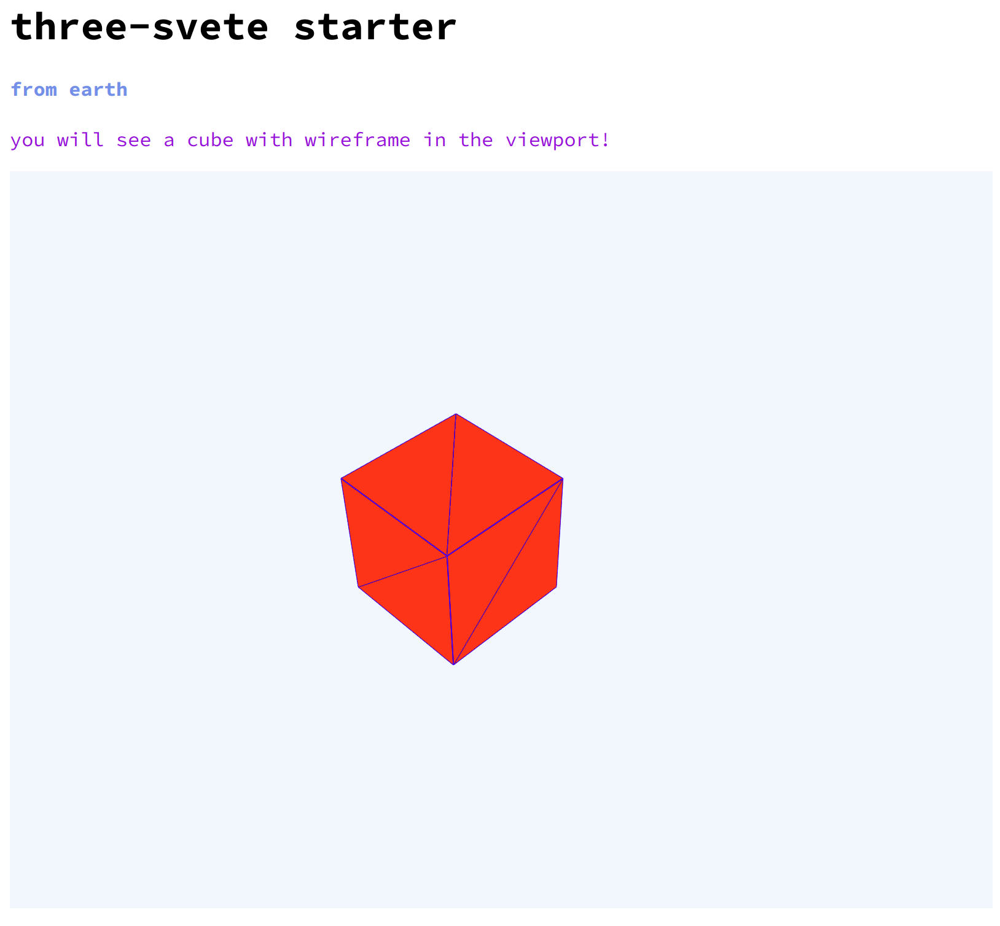

# three-svelte
a started project for three + svelte using webpack4

```js
$ npm i
$ npm start // open your browser and you'll see a cube with wireframe.
```

This simple project is created for your convience when you are developing or testing three.js.


